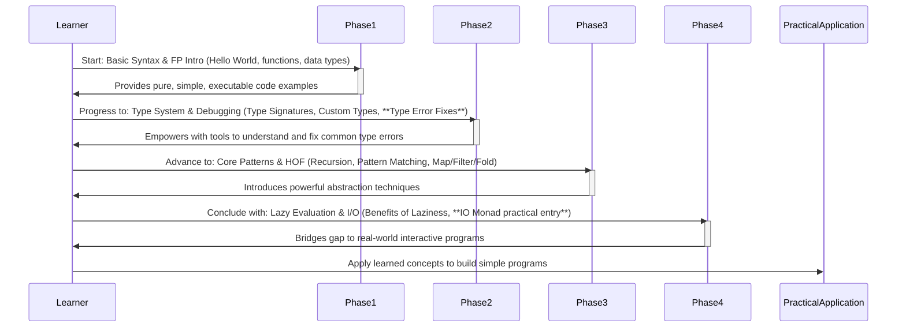

# Module Architecture Details

This document provides a deeper dive into the architectural design and pedagogical approach of the Foundational Haskell Learning Module. The module is structured to guide learners progressively from basic concepts to more advanced functional patterns and interaction with the outside world.

## Pedagogical Flow

The learning journey is divided into four distinct phases, each designed to build upon the previous one. This phased approach allows learners to consolidate understanding before moving to more complex topics, directly addressing the common challenges faced by Haskell beginners.

## Key Design Principles

1.  **Progressive Difficulty:** Concepts are introduced in a logical order, starting with the simplest pure functions and gradually moving towards effects and more abstract patterns.
2.  **Practical Application:** Every theoretical concept is immediately followed by simple, executable code examples that learners can run and modify.
3.  **Error-Centric Learning:** A dedicated focus on common type error messages, providing explanations and solutions, turns a common frustration point into a learning opportunity.
4.  **Demystification of Core Concepts:** Lazy evaluation and the `IO` Monad, often sources of confusion, are introduced with a practical, benefit-driven approach, avoiding unnecessary theoretical depth for beginners.
5.  **Minimal Dependencies:** The module primarily relies on `base` and standard GHC libraries to keep the focus on core Haskell and reduce setup friction.
6.  **Reproducible Environment:** Use of `Stack` ensures that all learners can set up an identical development environment and run the examples without compatibility issues.

## Codebase Structure

The `src` directory is organized into subdirectories corresponding to the four learning phases. Each `.hs` file within these subdirectories targets a specific concept, ensuring modularity and easy navigation. This structure directly maps to the pedagogical flow, making it easy for learners to find relevant examples as they progress through the module.

*   `Phase1_Foundations/`: Basic syntax, function definitions, `let`/`where` bindings.
*   `Phase2_TypesAndErrors/`: Type signatures, common data types (List, Tuple, Maybe, Either), custom types, and crucial type error debugging examples.
*   `Phase3_PatternsAndHOF/`: Recursion, pattern matching, higher-order functions (`map`, `filter`, `fold`), lambdas, function composition.
*   `Phase4_LazinessAndIO/`: Practical aspects of lazy evaluation (infinite lists) and the essential introduction to `IO` actions and `do` notation.

Each `.hs` file includes extensive comments, explaining the code and the underlying concepts, reinforcing the learning material.